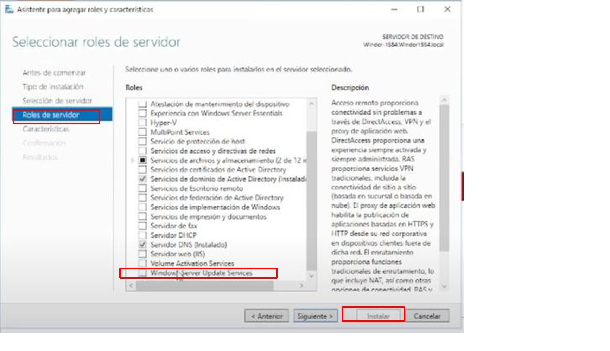
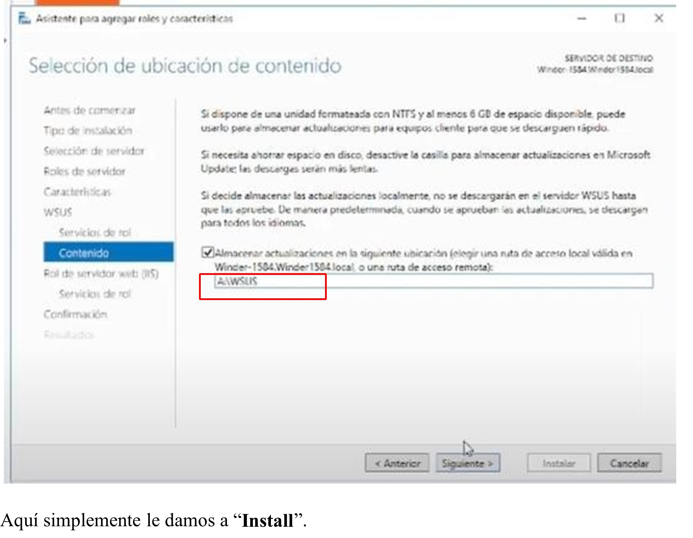

# Centralized-Patch-Management-WSUS

# Gestión de Parches con Windows Server Update Services (WSUS)

## 1. Introducción
La gestión de parches es una de las defensas más críticas en ciberseguridad. Este proyecto documenta la implementación de un servidor **WSUS** para centralizar, probar y aprobar actualizaciones antes de su despliegue en la red, evitando fallos de compatibilidad y optimizando el ancho de banda.

## 2. Implementación Técnica
* **Rol de Servidor:** Instalación y configuración del rol WSUS en Windows Server.
* **Sincronización:** Configuración de reglas de sincronización directa con Microsoft Update.
* **Grupos de Equipos:** Organización de dispositivos en grupos específicos para despliegues escalonados (Testing y Producción).

## 3. Configuración de Directivas (GPO)
Se crearon GPOs específicas para que los clientes del dominio busquen actualizaciones en el servidor local en lugar de internet:
* **Ubicación del servicio:** Configuración de la intranet para el servicio de actualizaciones.
* **Frecuencia de detección:** Ajuste del intervalo de búsqueda para asegurar que los equipos estén siempre al día.

## 4. Validación
* **Comando de fuerza:** Uso de `gpupdate /force` para aplicar las políticas de inmediato.
* **Consola de WSUS:** Verificación del estado de cumplimiento de los equipos desde el panel de administración.

  
  
  
